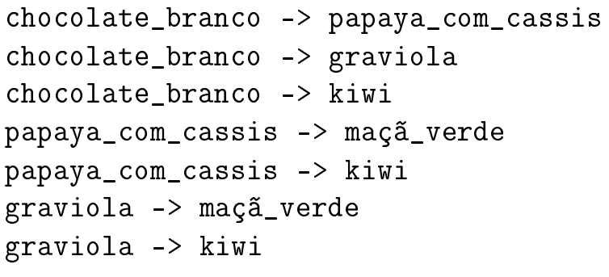
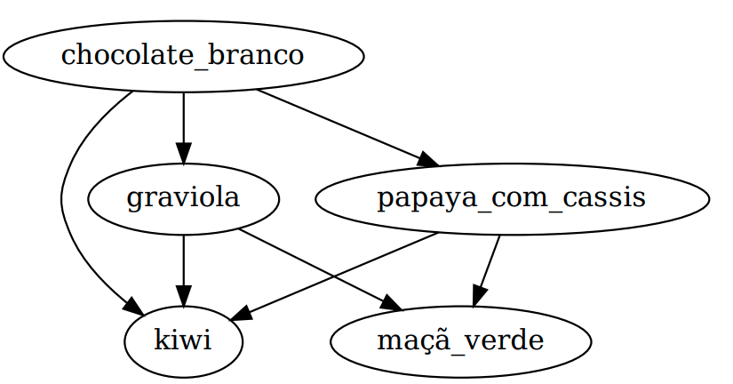

# A sorveteria dos horrores

Com o final do inverno e a chegada dos dias de primavera, seu primo acabou de abrir uma sorveteria que promete ser o sucesso da cidade, só que ele sempre foi o esquisito da família e a sorveteria tem algumas regras que preocupam a parentada:

- A sorveteria tem copinhos para 2 e 3 bolas de sorvete;
    

- Seu primo nunca coloca um sabor forte (ex.: chocolate mega-ultra-power-100\%) em cima de um sabor suave (ex.: iogurte), pois daí ninguém sente o sabor do suave quando chegar nele;
    

- Seu primo tem uma lista de quem-é-mais-forte-do-que-quem para se orientar na hora de servir os opinhos (de acordo com a opinião dele, mas isso é outra história);

- Ele nunca aceita pedidos om sabor repetido, para que as pessoas possam experimentar mais sabores;

Agora sua família está um pouco preocupada por que essas condições poderiam limitar bastante a quantidade de pedidos que podem ser atendidos. Eles pedem que você (o especialista em informática da família, já que instala Windows pra todo mundo) pegue a lista de quem-é-mais-forte-do-que-quem e diga quantos copinhos diferentes de sorvete são possíveis na sorveteria. Este é um exemplo de lista de sabores, como pode se observar na Figura 1. Ela diz, por exemplo, que graviola deve ser servido antes de kiwi.

</a>

O grafo que representa quem-é-mais-forte-do-quem pode ser observado na Figura 2.

</a>

Depois de analisar esta entrada de dados, você deve responder quantos copinhos de 2 e de 3 sabores podem ser servidos de maneira que os sabores fiquem na ordem desejada. Neste exemplo podem ser servidos 8 copinhos de 2 sabores e 4 copinhos de 3 sabores.
